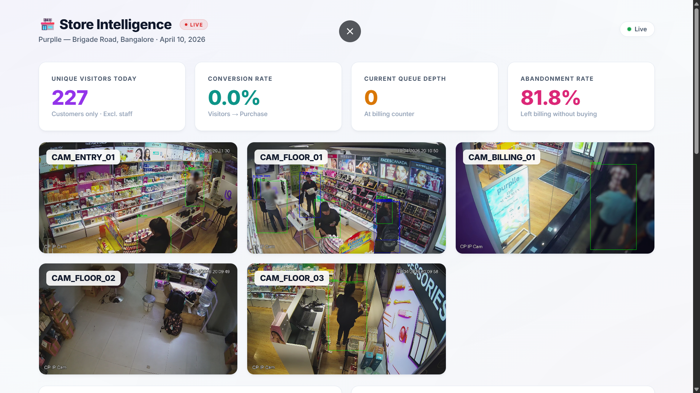
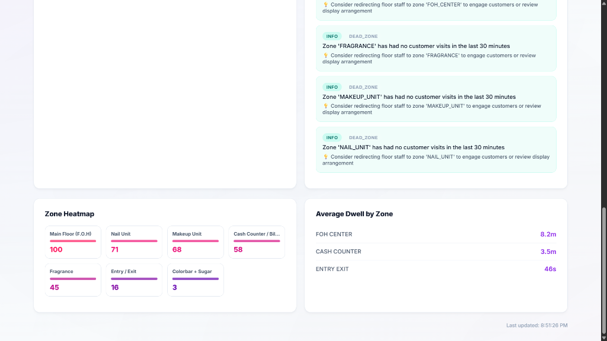
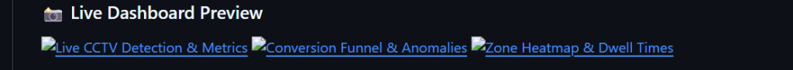

# Store Intelligence API 🛍️ 📹

**Purplle Tech Challenge 2026 — Round 2**  
*Turning raw offline CCTV footage into live, e-commerce style retail analytics.*

## 📖 About The Project

Physical retail stores have a massive analytics blind spot compared to e-commerce websites. While a website tracks every click, bounce, and conversion funnel step, physical stores often only know two things: footfall (from a door counter) and sales (from the POS). 

**Store Intelligence** bridges this gap. It is an end-to-end AI system that ingests raw CCTV video feeds, detects and tracks shoppers (while actively ignoring staff in uniform), maps their paths across physical store zones, and streams these events in real-time to a live dashboard. For the first time, offline stores get a live **Conversion Funnel**, **Zone Heatmaps**, and **Active Anomaly Alerts**.

### 📸 Live Dashboard Preview




---

## 🧠 System Architecture & Workflow

The system is split into two perfectly decoupled layers: an AI Computer Vision pipeline and a real-time FastAPI backend.

```text
┌─────────────────────────────────────────────────────────┐
│               DETECTION LAYER (pipeline/)               │
│  ┌──────────┐   ┌──────────────┐   ┌────────────────┐   │
│  │ CCTV     │──▶│  YOLOv8n     │──▶│   ByteTrack    │   │
│  │ (CAM1-5) │   │  Person Det. │   │   (track_id)   │   │
│  └──────────┘   └──────────────┘   └───────┬────────┘   │
│  ┌─────────────────────────────────────────▼──────────┐ │
│  │               PersonTracker (Re-ID)                │ │
│  │  • Color histogram Re-ID (384-dim feature vector)  │ │
│  │  • Cross-camera deduplication & re-entry tracking  │ │
│  └─────────────────────────────────────────┬──────────┘ │
│  ┌────────────────┐  ┌─────────────────────▼──────────┐ │
│  │ StaffDetector  │  │      ZoneMapper                │ │
│  │ (Color Hist +  │  │  (bbox_pct polygon mapping)    │ │
│  │ Groq Vision)   │  │  Centroid → Physical zone_id   │ │
│  └────────────────┘  └────────────────────────────────┘ │
└─────────────────────────────────────────────────────────┘
                          │ HTTP POST /events/ingest (Batch)
┌─────────────────────────▼───────────────────────────────┐
│                  API LAYER (app/main.py)                │
│  ┌─────────────┐   ┌──────────────┐   ┌─────────────┐   │
│  │ metrics.py  │   │ anomalies.py │   │  funnel.py  │   │
│  └─────────────┘   └─────────────┘   └─────────────┘   │
│                         │                               │
│                ┌────────▼────────┐                      │
│                │  SQLite (WAL)   │                      │
│                │  (Live Events)  │                      │
│                └─────────────────┘                      │
└─────────────────────────────────────────────────────────┘
```

**How the Workflow operates:**
1. **Detection & Tracking:** YOLOv8 detects people at ~30 FPS, and ByteTrack handles partial occlusions and ID assignment frame-to-frame.
2. **Re-ID:** If a person leaves CAM 1 and enters CAM 2, the `PersonTracker` re-identifies them using a 384-dimensional color histogram of their clothing.
3. **Staff Exclusion:** The system extracts the torso color. If it matches Purplle's purple uniform, they are flagged as staff. For ambiguous lighting, it falls back to a fast call to `Groq Vision (llama-3.2-11b-vision-preview)` for a second opinion. Staff are ignored in all analytics.
4. **Zone Mapping & Emission:** Bounding box coordinates are mapped to 2D store layout polygons. Transitions are batched into HTTP requests and sent to the API.
5. **Real-time Analytics:** The FastAPI backend stores events in a highly concurrent SQLite WAL database and instantly computes Live Metrics, Funnels, and Anomalies for the frontend dashboard.

---

## 🚀 Easiest Way to Run (Windows)

If you are evaluating this on a Windows machine, you can launch the entire system in just a few clicks:

1. **Clone the repository** and open the `store-intelligence` folder.
2. **Double-click `start.bat`**. This will automatically:
   - Start the FastAPI Backend on port 8000.
   - Start the Live Dashboard on port 3000.
3. Open your browser and go to **http://localhost:3000** to see the beautiful SaaS Dashboard.
4. **Start the AI Detection Pipelines** by opening a terminal in the folder and running:
   ```powershell
   venv\Scripts\python.exe pipeline/detect.py --video "..\CCTV Footage\CAM 1.mp4" --camera-id CAM_ENTRY_01 --store-id STORE_BLR_001 --clip-start 2026-04-10T11:00:00Z --layout data/store_layout.json
   ```
   *(Repeat for CAM 2 to 5 to run them simultaneously. The videos will loop infinitely to provide a continuous live demo!)*

---

## 🐳 Docker Quick Start (Cross-Platform)

```bash
# 1. Clone and enter project
git clone <repo-url> && cd store-intelligence

# 2. Set your Groq API key (Optional for Staff Detection)
cp .env.example .env
# Edit .env and set GROQ_API_KEY=your_key_here

# 3. Start the API and Dashboard
docker compose up -d

# 4. Run the detection pipeline against the CCTV clips
FOOTAGE_DIR="/path/to/CCTV Footage" docker compose run --rm pipeline
```

---

## 🐍 Manual Setup (Standard Python Environment)

If you prefer running the code directly on your system without Docker or the `.bat` file:

```bash
# 1. Clone and navigate to the project
git clone <repo-url> && cd store-intelligence

# 2. Create and activate a virtual environment
python -m venv venv
# On Windows: venv\Scripts\activate
# On Mac/Linux: source venv/bin/activate

# 3. Install dependencies
pip install -r app/requirements.txt
pip install -r pipeline/requirements.txt

# 4. Start the FastAPI Backend
uvicorn app.main:app --host 127.0.0.1 --port 8000 &

# 5. Start the Live Dashboard
python -m http.server 3000 --directory dashboard &

# 6. Run the AI Pipeline
python pipeline/detect.py --video "/path/to/CCTV Footage/CAM 1.mp4" --camera-id CAM_ENTRY_01 --store-id STORE_BLR_001 --clip-start 2026-04-10T11:00:00Z --layout data/store_layout.json
```

The API is available at **http://localhost:8000** | Docs at **http://localhost:8000/docs**

---

## API Endpoints

| Method | Endpoint | Description |
|--------|----------|-------------|
| POST | `/events/ingest` | Ingest detection events (batch ≤ 500) |
| GET | `/stores/{id}/metrics` | Unique visitors, conversion rate, dwell, queue |
| GET | `/stores/{id}/funnel` | Entry → Zone → Billing → Purchase funnel |
| GET | `/stores/{id}/heatmap` | Zone visit frequency, normalised 0-100 |
| GET | `/stores/{id}/anomalies` | Queue spikes, conversion drops, dead zones |
| GET | `/health` | Service status, camera feed staleness |

**Store ID**: `STORE_BLR_001` (Brigade Road, Bangalore)

---

## Running the Detection Pipeline

The pipeline processes all 5 CCTV cameras in sequence:

```bash
# Run against all clips (batch mode)
cd store-intelligence
FOOTAGE_DIR="/path/to/CCTV Footage" \
GROQ_API_KEY="your_key" \
python pipeline/detect.py \
  --video "/path/to/CCTV Footage/CAM 1.mp4" \
  --camera-id CAM_ENTRY_01 \
  --store-id STORE_BLR_001 \
  --clip-start 2026-04-10T11:00:00Z \
  --layout data/store_layout.json

# Or use the convenience script (all cameras at once)
bash pipeline/run.sh

# Test with limited frames (faster):
python pipeline/detect.py --video "CAM 1.mp4" --camera-id CAM_ENTRY_01 \
  --store-id STORE_BLR_001 --clip-start 2026-04-10T11:00:00Z \
  --layout data/store_layout.json --max-frames 500
```

---

## Running Tests

```bash
# Install test dependencies
pip install -r app/requirements.txt

# Run all tests with coverage
pytest tests/ --cov=app --cov-report=term-missing -v

# Run specific test file
pytest tests/test_ingestion.py -v
pytest tests/test_metrics.py -v
```

---

## Architecture

```
CCTV Clips → YOLOv8n + ByteTrack → PersonTracker (Re-ID) →
StaffDetector (color + Groq Vision) → ZoneMapper →
EventEmitter → POST /events/ingest → SQLite (WAL) →
GET /metrics, /funnel, /heatmap, /anomalies
```

See [DESIGN.md](docs/DESIGN.md) for full architecture.  
See [CHOICES.md](docs/CHOICES.md) for engineering decisions.

---

## Project Structure

```
store-intelligence/
├── pipeline/          # CCTV detection pipeline
│   ├── detect.py      # Main detection + tracking script
│   ├── tracker.py     # Re-ID / cross-camera tracking
│   ├── zone_mapper.py # Zone assignment from layout
│   ├── staff_detector.py  # Color + Groq Vision staff detection
│   ├── emit.py        # Event construction + HTTP emission
│   └── run.sh         # One-command pipeline runner
├── app/               # FastAPI Intelligence API
│   ├── main.py        # API entrypoint (all routes)
│   ├── models.py      # Pydantic + SQLModel schemas
│   ├── ingestion.py   # Event ingest + dedup
│   ├── metrics.py     # Real-time metric computation
│   ├── funnel.py      # Conversion funnel logic
│   ├── heatmap.py     # Zone heatmap
│   ├── anomalies.py   # Anomaly detection
│   ├── health.py      # Health endpoint
│   └── database.py    # SQLite + POS data loading
├── tests/             # Pytest test suite
├── docs/
│   ├── DESIGN.md      # Architecture + AI decisions
│   └── CHOICES.md     # 3 engineering decisions
├── data/
│   ├── store_layout.json      # Brigade Rd store zones
│   └── pos_transactions.csv   # April 10, 2026 POS data
├── docker-compose.yml
├── Dockerfile.api
├── Dockerfile.pipeline
└── README.md
```

---

## Live Dashboard (Part E)

The live dashboard is available when started with:

```bash
docker compose --profile dashboard up
```

Then visit **http://localhost:3000** to see real-time metrics updating as events flow in.

Alternatively, stream metrics via the API:
```bash
watch -n 2 "curl -s http://localhost:8000/stores/STORE_BLR_001/metrics | python -m json.tool"
```

---

## Environment Variables

| Variable | Default | Description |
|----------|---------|-------------|
| `GROQ_API_KEY` | required | Groq API key for Vision staff detection |
| `API_BASE_URL` | `http://localhost:8000` | API endpoint for pipeline |
| `DB_PATH` | `/data/store_intelligence.db` | SQLite database path |
| `POS_CSV_PATH` | `/data/pos_transactions.csv` | POS transactions CSV |
| `STORE_LAYOUT_PATH` | `/data/store_layout.json` | Store zone definitions |
| `FOOTAGE_DIR` | `../CCTV Footage` | Path to CCTV video files |
